# IFSC_2021-1_PI-3_MIKAEL

Implementação de uma arquitetura sistólica para multiplicação de matrizes em FPGA

## Cronograma

| Atividade                                                         | Cronograma   |
| ----------------------------------------------------------------- | ------------ |
| [X] Desenhar o diagrama de blocos                                 | (04/06/2021) |
| [X] Pesquisar tipos de arquiteturas                               | (11/06/2021) |
| [X] Implementação da arquitetura escolhida                        | (25/06/2021) |
| [X] Testbench automátizado para validar a arquitetura             | (02/07/2021) |
| [X] Configuração do SoC/FPGA                                      | (01/09/2021) |
| [X] Comunicação SoC com FPGA                                      | (08/09/2021) |
| [ ] Debug e Revisão                                               | (11/09/2021) |
| [ ] Treinamento de uma NN simples para testar o funcionamento     | (18/09/2021) |
| [ ] Verificar a diferença do desempenho com e sem a implementação | (25/09/2021) |
| [ ] Documentar                                                    | (05/09/2021) |

## Diagrama de Blocos

Uma visão geral do funcionamento pode ser visto nesse diagrama.

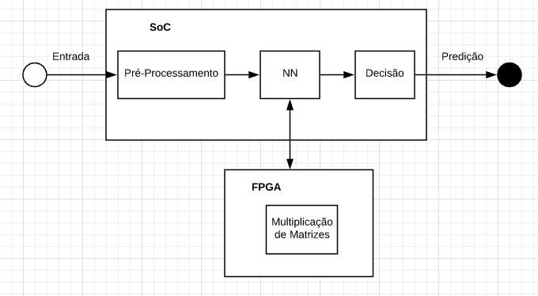

Fonte: Autoria própria

Onde o processador faz uso do hardware físico para operações expecíficas e 
computacionalmente custosas. Nesse caso em particular uma rede neural embarcada 
utiliza o hardware especializado para fazer multiplicação de matrizes ou matriz 
e vetores.

## Arquitetura Sistólica

O princípio básico de um sistema sistólico é a de minimizar a comunicação com 
dispositivos com alta latência (memória, I/O) e fazer o máximo possível com o 
dado em mãos. Algumas características dessa arquitetura é a sua simplicidade e 
regularidade e seu altissísimo nível de paralelização.

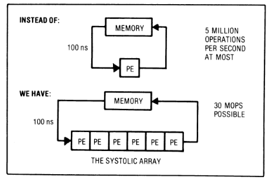

Fonte: [Why Systolic Architectures?](https://www.cs.virginia.edu/~smk9u/CS4330S19/kung_-_1982_-_why_systolic_architectures.pdf)

O elemento mais básico de uma arquitetura sistólica é a unidade de processamento
(processing element - PE), cada célula faz apenas uma computação e passa o 
resultado adiante. Um exemplo de tal unidade pode ser visto aqui:

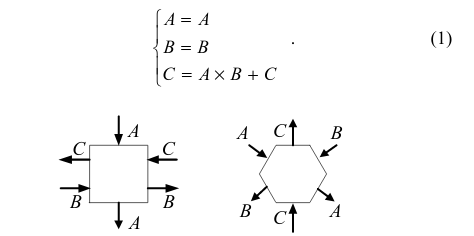

Fonte: [High-Performance Systolic Arrays for Band Matrix Multiplication](https://ieeexplore.ieee.org/document/1464792)

E essas unidade de processamentos podem ser organizadas em diferentes dimensões,
1D como um vetor, 2D como matriz e além. A seguinte figura mostra uma 
configuração em 3D.

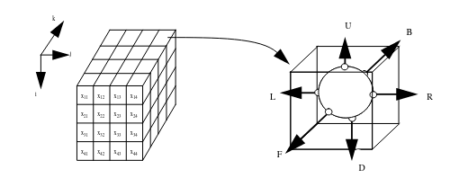

Fonte: [An Efficient Parallel Algorithm for the All Pairs Shortest Path Problem using Processor Arrays with Reconfigurable Bus Systems](https://citeseerx.ist.psu.edu/viewdoc/download?doi=10.1.1.1004.9008&rep=rep1&type=pdf)

As células podem ser dispostas em diferentes configurações para alcançar 
diferentes objetivos como filtros, operações com matrizes, e convoluções.
Um exemplo que eu achei complexo é o [calculo dos mínimos quadrados em tempo real usando uma arquitetura sistólica](http://www.eecs.harvard.edu/~htk/publication/1981-matrix-triangularization-by-systolic-arrays.pdf):

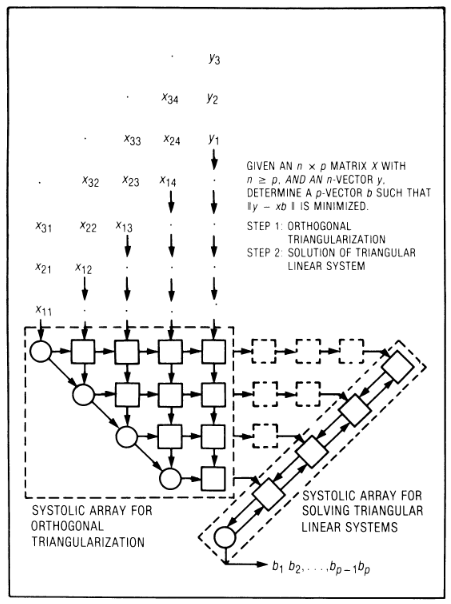

Fonte: [Why Systolic Architectures?](https://www.cs.virginia.edu/~smk9u/CS4330S19/kung_-_1982_-_why_systolic_architectures.pdf)

### Multiplicação de matrizes

O objetivo desse projeto é o de fazer uso de uma arquitetura sistólica para a 
múltiplicação de matriz/matriz e matriz/vetor aliviando assim a carga para um 
processador de propósito geral. Na literatura há implementações para esse tipo 
de sistema algumas mais intuitivas que outras, fazendo uso ou não de matrizes 
esparças.

O sistema mais conhecido para mútiplicação de matriz/matriz é esse

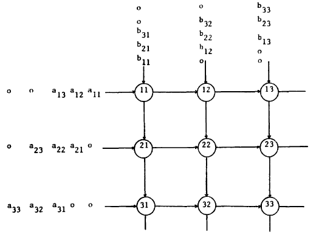

Fonte: [A two-layered mesh array for matrix multiplication](https://www.sciencedirect.com/science/article/abs/pii/0167819188900786?via%3Dihub)

Mas como observado pelo artigo a latência para a solução disso é de 3n-2 onde n 
é a dimensão da matriz. Seguindo o artigo, pretendo implementar a seguinte 
configuração onde a latência é de 2n-1.

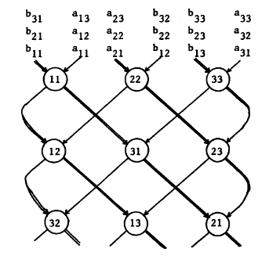

Fonte: [A two-layered mesh array for matrix multiplication](https://www.sciencedirect.com/science/article/abs/pii/0167819188900786?via%3Dihub)

## Testbench Automatizado

O script de automação foi feito em python, o workflow básico é o seguinte:
1. O script gera números aleatórios e grava isso em um arquivo.
2. O arquivo de testbench.vhd lê os valores gerados.
3. Os valores lidos são passados para a matriz que computa a multiplicação.
4. O resultado é armazenado em um arquivo.
5. O script em python lê os números gerados anteriormente computa a 
multiplicação e compara com o resultado do testbench.
6. Caso haja algum erro é exibido as entradas que produziram o resultado errado 
e mostra qual foi a resposta produzida pela arquitetura e qual é a resposta 
correta dada pelo modelo em python.

## SoC-FPGA

Estou usando o kit de desenvolvimento [Arrow](https://www.arrow.com/en/products/sockit/arrow-development-tools) com [Cyclone V](https://www.intel.com/content/dam/www/programmable/us/en/pdfs/literature/hb/cyclone-v/cv_5v2.pdf) que possue um ARM Cortex-A9 e um FPGA com 110K elementos lógicos programáveis além de muitos outros periféricos como VGA, USBs, Ethernet etc.

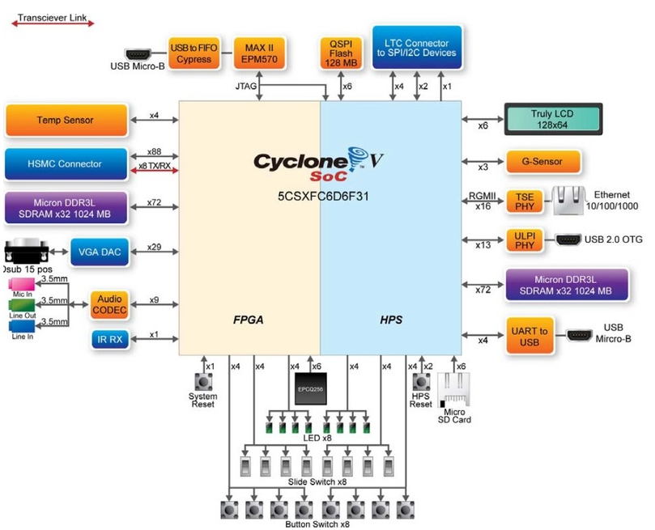

Fonte: [rocketboards](https://rocketboards.org/foswiki/Documentation/ArrowSoCKitEdition201707)

A Intel disponibilizou em seu site www.rocketboards.org um [manual de usuário](https://rocketboards.org/foswiki/Documentation/ArrowSoCKitEdition201707) desse kit para as primeiras configurações, que me foram muito úteis para entender o processo básico de boot e [configuração dos switchs](https://rocketboards.org/foswiki/Documentation/ArrowSoCKitEdition201707ConfiguringTheSockit).

### Pré-requisitos

- Sistema operacional linux
- [ARM Toolchain](https://developer.arm.com/tools-and-software/open-source-software/developer-tools/gnu-toolchain/gnu-a/downloads)
- Ferramentas para desenvolvimento [Intel SoC FPGA](https://www.intel.com.br/content/www/br/pt/software/programmable/soc-eds/overview.html)
- [Quartus II](https://fpgasoftware.intel.com/?edition=lite)
- Paciência (Não Opcional)

Faça download da toolchain com nome arm-none-linux-gnueabihf. Uma breve explicação sobre a terminologia usada na toolchain segue:

O linux no nome diz que essa gcc foi preparada para rodar em uma plataforma linux.
- eabi: Embedded Application Binary Interface
- hf: Hard Floating (permite computação de ponto flutuante em hardware)

É possível bootar a placa de formas diferentes como através do FPGA, do cartão SD, do QSPI ou flash NAND. Aqui estão as opções de boot segundo o manual de usuário do SoCKit.

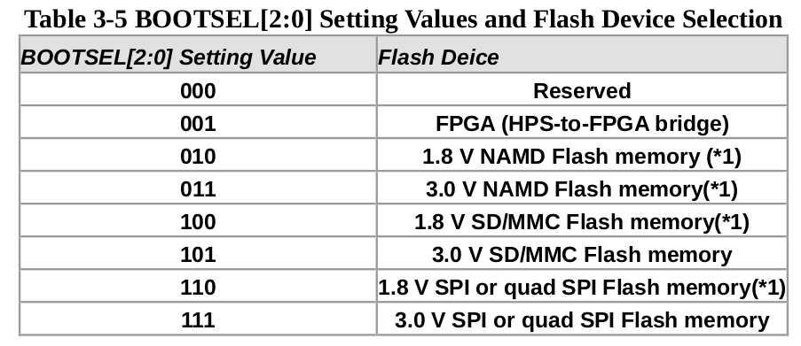

Como eu estou usando uma cartão SD eu fiz a seguinte configuração como orientado pela rocketboards

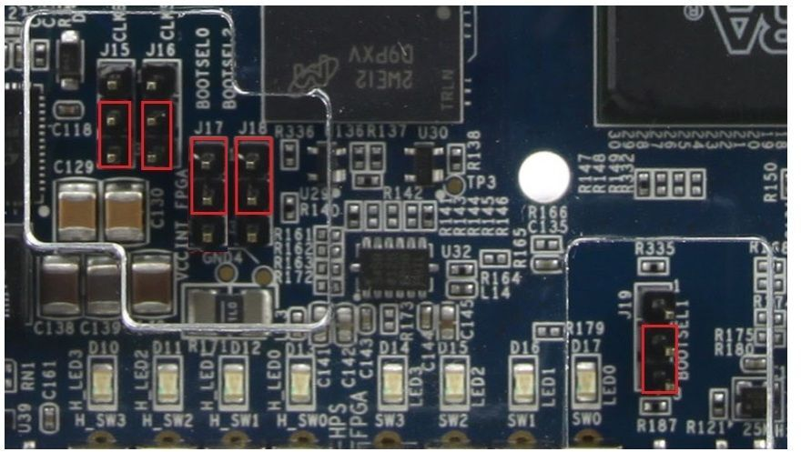

Fonte: [rocketboards](https://rocketboards.org/foswiki/Documentation/ArrowSoCKitEdition201707ConfiguringTheSockit)

Para poder fazer a programação parcial do FPGA, isso poder reprogramar alguns setores enquanto outros ficam intactos, é necessário que o switch 6 da placa esteja em uma dessas configurações segundo o manual de referencia técnico do Cyclone V.

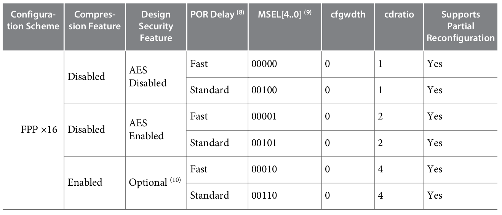

Eu escolhi a última opção que é o MSEL=00110 como pode ser visto abaixo

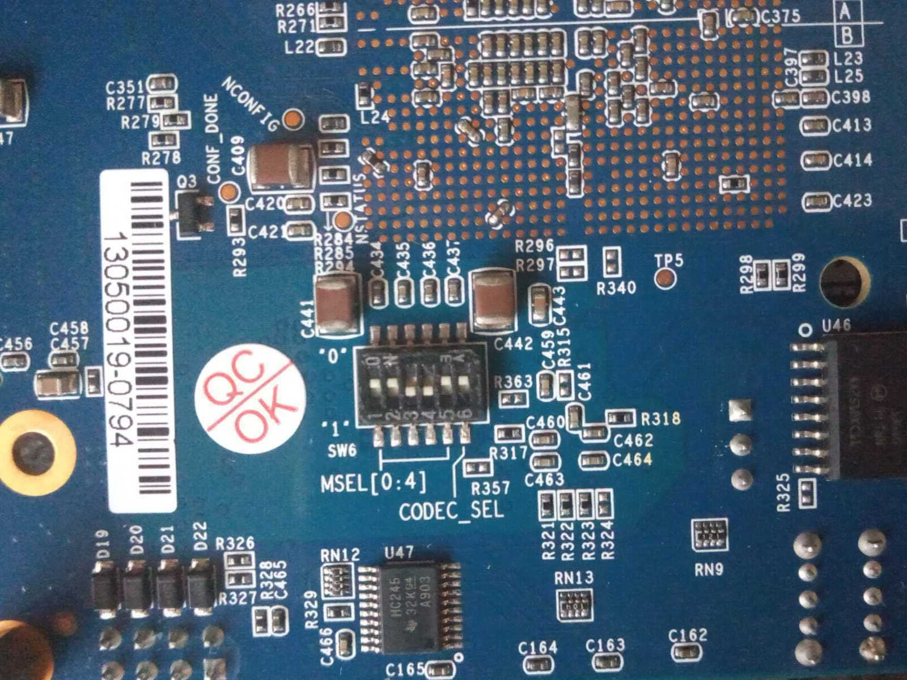

Perceba que a última chave não é usada.

### Configuração do cartão SD

Estruturação das partições no cartão SD

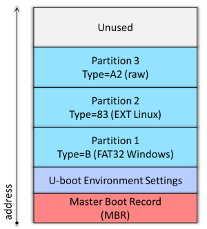

Referência: [rocketboards](https://rocketboards.org/foswiki/Documentation/A10GSRDCreatingAndUpdatingTheSDCardLTS)

| Localização | Nome do Arquivo        | Descrição                |
| ----------- | ---------------------- | ------------------------ |
| Partição 1  | *.dtb                  | Descrição do hardware    |
| ^           | *core.rbf              | Configuração do FPGA     |
| ^           | *periph.rbf            | Configuração dos IOs     |
| ^           | zImage                 | Imagem do Kernel         |
| ^           | extlinux/extlinux.conf | Configuração do Uboot    |
| ^           | u-boot.img             | Imagem do Uboot          |
| ^           | *.itb                  | Uboot FIT                |
| Partição 2  | qualquer               | Sistema de Arquivo Linux |
| Partição 3  | N/A                    | espaço Uboot             |

Tanto a referência da imagem quanto a descrição dessa tabela podem ser encontradas [aqui](https://rocketboards.org/foswiki/Documentation/A10GSRDCreatingAndUpdatingTheSDCardLTS)

Nem todos os arquivos da partição 1 são de fato necessários para fazer a placa bootar, por exemplo os arquivos de configuração servem para que a placa o FPGA seja programado logo que dispositivo seja energizado. Mas é possível programar a partir do sistema operacional que é o que farei para poder testar e modificar rapidamente.

Para criar as partições do cartão SD eu recomendo usar o fdisk do próprio sistema linux. Rocketboards disponibiliza um script em python para gerar uma imagem pronta para ser gravada no cartão de memória com as três partições feitas, eu tive alguns problemas e por isso eu prefiro fazer a configuração usando o fdisk e gravar as imagens individualmente nas devidas partições.

Eu segui essas [intruções](https://zhehaomao.com/blog/fpga/2013/12/24/sockit-2.html) e vou repassar elas abaixo caso o link suma.

__Aviso__: Muito cuidado com o local onde o cartão SD foi montado no seu computador, isso pode variar de pc para pc e pode ter consequências sérias caso o dispositivo errado seja formatado como a perda permanete de dados ou até mesmo a corrupção do seu SO.

1. Conecte o cartão SD no computador
2. sudo fdisk -l para identificar qual device é o cartão SD
3. sudo fdisk /dev/sdX (substitua X pelo local correto)
4. delete partições existentes
5. Sequência de comandos: (\<enter> significa enter sem comando)
```
n
p
3
2048
+2048
t
a2
n
p
<enter>
<enter>
+256M
t
1
0b
n
p
<enter>
<enter>
<enter>
w
```

### Ordem do boot

Esse é o flow do U-Boot de acordo com [rocketboards](https://rocketboards.org/foswiki/Documentation/BuildingBootloader#U_45Boot_Build_Flows)

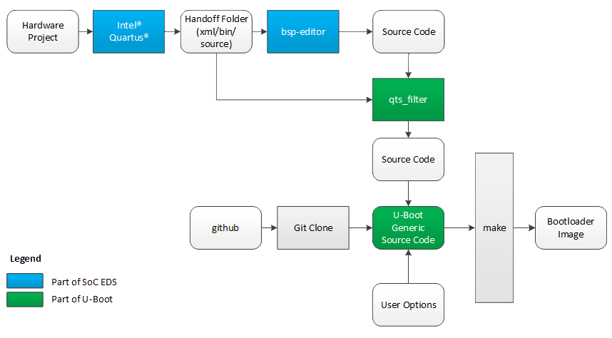

Tentei fazer a placa bootar sem o qts_filter mas não fui bem sucedido.

Segundo o manual de referência técnico o boot se dá na seguinte ordem

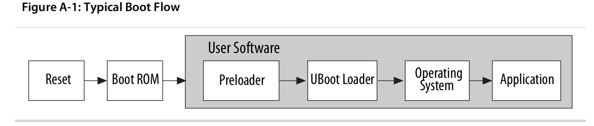

A inicialização da placa segundo o [manual de referência técnico](https://www.intel.com/content/dam/www/programmable/us/en/pdfs/literature/hb/cyclone-v/cv_54001.pdf) do cyclone V

1. O reset coloca a placa em um estado conhecido
2. O boot ROM é configurado de fábrica e inicializa o HPS e começa a execução do Preloader.
3. O Preloader da figura ou SPL (Secound Prestage Loader) inicaliza os periféricos necessários para o U-Boot assumir, notadamente a SRAM.
4. Com os periféricos minimamente inicializados o kernel assume fazendo o serviço restante e inicia o sistema de arquivo.
5. A aplicação é o que você quiser fazer.

### Scripts

Nota: O bsp-create-settings se encontra dentro do conjunto de aplicativos shell da intel e para fazer uso é necessário passar o caminho completo de onde se encontra no seu sistema. 

Por exemplo: eu instalei a ferramenta de desenvolvimento no meu computador em ~/software/intelFPGA/20.1/
então para que eu faça uso eu tenho que chamar o script dessa maneira:
~/software/intelFPGA/20.1/embedded/embedded_command_shell.sh bsp-create-settings

U-Boot
``` bash
# Modelo de referência disponibilizado pela Intel
git clone https://github.com/arrow-socfpga/arrow-sockit-ghrd.git
cd arrow-sockit-ghrd
# Branch mais atual
git checkout -b sockit_build sockit-ghrd-19.1

# Criar board support package (bsp) do projeto
bsp-create-settings \
 --type spl \
 --bsp-dir software/bootloader \
 --preloader-settings-dir hps_isw_handoff/sockit_ghrd_hps_0/ \
 --settings software/bootloader/settings.bsp

# Mudar para diretório bootloader
cd software/bootloader

# Arquivos do U-Boot
git clone http://git.rocketboards.org/u-boot-socfpga.git
cd u-boot-socfpga

git checkout -b build_boot socfpga_v2020.07
# qts_filter, formatar os arquivos bsp e copiar para o U-Boot
./arch/arm/mach-socfpga/qts-filter.sh cyclone5 ../../../ ../ ./board/altera/cyclone5-socdk/qts/

# Toolchain a ser usada, deve estar no PATH ou ser passada a localização dela no seu sistema
export CROSS_COMPILE=arm-none-linux-gnueabihf-
# Arquitetura a ser usada
export ARCH=arm

# Limpa configurações antigas
make mrproper

# Configurar e compilar U-Boot
make socfpga_cyclone5_config
make

# Gravar u-boot na partição do SD (substitua por seu dispositivo correto)
sudo dd if=u-boot-with-spl.sfp of=/dev/sdX3 bs=512 status=progress
# Garantir que tudo foi gravado no SD
sudo sync
```
Referências consultadas: [U-Boot](https://rocketboards.org/foswiki/Documentation/Gsrd131GitTrees#U_45Boot), [norstrand](http://www.norstrand.priv.no/posts/2020-10-12-arrow_sockit_-_u-boot/)

Para buildar o kernel se pode seguir a referência citada no final desse documento ou se pode usar o defconfig que disponibilizei aqui no github com o nome de arrow_kernel_defconfig só copie para dentro da pasta que vai compilar o kernel em arch/arm/configs

``` bash
# Carregue as configurações para build
make arrow_kernel_defconfig
# Compile
make LOCALVERSION=zImage -j8
```

Isso irá gerar a imagem do kernel compactada. E para o sistema de arquivo você pode colocar o que quiser, arch-linux, debian etc. Ou fazer o seu próprio com yocto ou o buildroot.

Após ter isso feito copie o kernel para dentro da partição 1 e o sistema de arquivo para a partição 2.

Mais uma coisa: para poder fazer uso das 4 pontes do FPGA é necessário habilitar todas a pontes no dts como fiz no arquivo arrow_mikael.dts disponibilizado aqui no repositório. 

``` bash
# Build dtb pela árvore do kernel (kernel tree)
# Esse arquivo deve estar em arch/arm/boot/dts
make arrow_mikael.dts
# Outra opção usando device tree compilers
dtc -O dtb -o arrow_mikael.dts arrow_mikael.dtb
```
Copie o .dtb para a mesma partição do kernel

Com tudo feito aí em cima (se eu não esqueci de alguma coisa) a placa deve iniciar normalmente.

Para configurar o DTO na placa eu fiz um script chamado de flash_fpga.sh que também está aqui no repositório. Os arquivos <module_name>.rbf e <module_name>.dtbo devem estar no mesmo diretório que o script.

``` bash
# Configurar os diretórios
./flash_fpga.sh init
# Adicionar o seu dto e flexar a placa
./flash_fpga.sh add_dto <module_name>
# Remover dtbo 
./flash_fpga.sh remove_dto <module_name>
# Habilitar caso já tenha sido adicionado anteriormente
./flash_fpga.sh enable_dto <module_name>
# Excluir completamente
./flash_fpga.sh wipeout_dto <module_name>
```

Para entender o que o script está fazendo eu recomendo ler o arquivo.

## Melhor referência

Infelizmente não encontrei isso quando estava começando nessa jornada, o melhor tutorial que encontrei está no github [aqui](https://github.com/zangman/de10-nano/wiki/Introduction-to-SoCs) ele foi feito para a DE10-nano mas os conceitos são os mesmos. Ele dá uma introdução muito boa ao QSYS, ao Device Tree Overlay e como fazer para programar o FPGA através do kernel. Também no build do kernel para possibilitar a utilização do DTO.

Como é dito no tutorial citado acima é necessário que as pontes do FPGA estejam ativas, no meu caso quando eu fiz o build do kernel só consegui ver duas pontes a Lightweight e a hps2fpga. Para habilitar todas as pontes eu fiz uma cópia do DTS usado no build (socfpga_cyclone5_socdk.dts) e habilitei as duas pontes. O DTS está aqui no repo com o nome muito criativo de arrow_mikael.dts.

Siga o exemplo do somador para enteder como o sistema de mapeamento de memória do Avalon funciona. Há outras opções mais avançadas como pipeline ou burts (estou usando burst aqui no projeto da matrix), para saber as possibilidades e como fazer consulte a [documentação da intel](https://www.intel.com/content/dam/www/programmable/us/en/pdfs/literature/manual/mnl_avalon_spec.pdf).